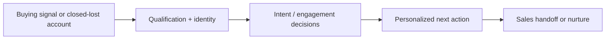
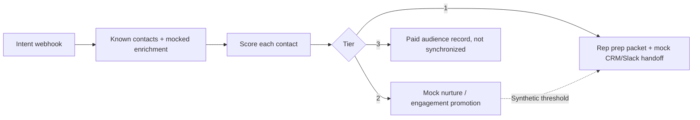
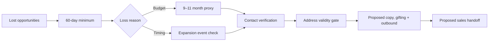

# AI-Powered GTM Acquisition Systems

**A technical portfolio of two n8n acquisition-automation prototypes.** These examples use synthetic data and illustrate architecture and decision logic; they are **not production deployments or measured campaign results**.

## At a glance

| Project | The problem | Evidence in the prototype |
|---|---|---|
| **[01 · Rep Empowerment Engine](docs/rep-empowerment.md)** | Help reps prioritize and work leads when intent spikes. | Synthetic contact enrichment, weighted engagement/intent scoring, three-tier routing, drafted rep packet, promotion concept. |
| **[02 · Closed-Lost Reactivation](docs/reactivation.md)** | Surface previously lost deals when meaningful buying conditions change. | Loss-reason branching, budget/expansion/new-hire triggers, contact verification gates, conceptual gifting and outbound orchestration. |

## 01 / Rep Empowerment Engine

Scoring formula: **2 × opens + 5 × clicks + 4 × visits + 0.3 × account intent + role weight**. Tier 1 begins at **45**, Tier 2 at **20**, and Tier 3 is below **20**. These are illustrative heuristics, not a trained propensity model.

[Technical walkthrough](docs/rep-empowerment.md) · [Inspect sanitized n8n JSON](workflows/rep-empowerment-demo.json)

## 02 / Closed-Lost Reactivation

This flow is an **architecture prototype**: live CRM filters and provider mappings need implementation; HTTP destinations have been intentionally disabled; the AI-copy node is a placeholder and does **not** call a model.

[Technical walkthrough](docs/reactivation.md) · [Inspect sanitized n8n JSON](workflows/closed-lost-reactivation-architecture.json)

## Explore

- [Technical boundaries and engineering work still required](docs/technical-notes.md)
- [Sharing and ownership checklist](SHARING-CHECKLIST.md)
- [Standalone scoring exercise](examples/scoring-demo.js) with [synthetic fixtures](examples/fixtures/synthetic-contacts.json): run `node examples/scoring-demo.js` to exercise tier scoring without n8n.

**Important disclosure:** These are demonstrations of design and implementation logic, not evidence of tested provider integrations, production AI agents, live campaign sends, or revenue impact. The workflows are inactive and use synthetic examples. Do not import into a connected production n8n instance. No license for reuse is granted. Distribution rights and confidentiality should be checked before external access.
