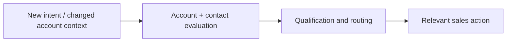

# Acquisition Automation

Two workflow examples showing how prospect and opportunity data can drive **prioritization, structured decisions and timely sales action**.

## Rep Empowerment Engine

**[Explore the system](../docs/rep-empowerment.md)** · [Inspect n8n JSON](../workflows/rep-empowerment-demo.json)

An incoming intent signal leads to contact research, engagement and role-based scoring, and three routes:

- **High priority:** Build a rep briefing with relevant talking points, outreach drafts, proof and a contact plan.
- **Developing interest:** Enter a lighter nurture path, with promotion when engagement crosses a threshold.
- **Lower priority:** Prepare a segment for paid retargeting and continued awareness.

## Closed-Lost Reactivation

**[Explore the architecture](../docs/reactivation.md)** · [Inspect n8n JSON](../workflows/closed-lost-reactivation-architecture.json)

An opportunity-recovery system based on **what has changed since a deal was lost**. The design combines loss reason, timing, new-hire and expansion signals, contact resolution and coordinated reactivation.

These are early workflow examples with synthetic inputs and some simulated external steps, shared to illustrate their logic and architecture.

[← Portfolio home](../README.md)
