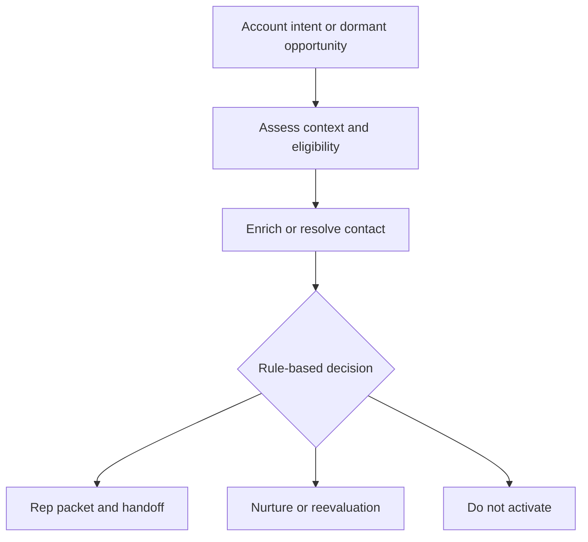

# Acquisition systems

**Focus:** How buying signals, account data and business rules can produce repeatable acquisition motions.

| Prototype | Primary logic | Implementation evidence |
|---|---|---|
| **[Rep Empowerment Engine](../docs/rep-empowerment.md)** | Account intent → enrichment → deterministic contact scoring → three-tier routing | [22-node synthetic n8n workflow](../workflows/rep-empowerment-demo.json), [scoring exercise](../examples/scoring-demo.js) |
| **[Closed-Lost Reactivation](../docs/reactivation.md)** | Prior loss context → new opportunity trigger → contact verification → proposed reactivation | [42-node architecture export](../workflows/closed-lost-reactivation-architecture.json), [import limitations](../WORKFLOW-IMPORT-NOTES.md) |

### How to review

Start with [Rep Empowerment's scoring and routing](../docs/rep-empowerment.md) for executable-style logic, then review [Reactivation](../docs/reactivation.md) as a more conceptual multi-system architecture.

**Implementation status:** Inactive prototypes with synthetic data, mock integrations, disabled HTTP targets and known incomplete mappings. They are not evidence of deployed AI SDR infrastructure or campaign results.

[← Portfolio home](../README.md)
