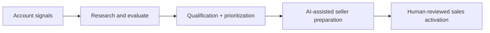

# Acquisition & AI Workflow Systems

This section focuses on the systems connecting **account signals, AI research, qualification, and rep action**.

| Project | Core capabilities | Explore |
|---|---|---|
| **AI Prospecting Intelligence Platform** | Production signal scanning, company research, Claude-powered outreach, sales-asset matching and human approvals | [Project overview](../systems/ai-prospecting-intelligence.md) |
| **Wake the Dead** | Closed-lost signal qualification, AI loss-context synthesis, contact verification, gifting and event-driven rep activation | [38-slide deck and walkthrough](../docs/reactivation.md) |
| **Rep Empowerment Engine** | Intent enrichment, contact scoring, three-tier routing, rep briefing and nurture decisions | [n8n workflow](../docs/rep-empowerment.md) |

## How these projects connect

The collection spans a deployed AI application, a detailed multi-system campaign design, and an n8n workflow sample. Each explores a different point where AI can turn market intelligence into meaningful GTM action.

[← AI portfolio](../README.md)
