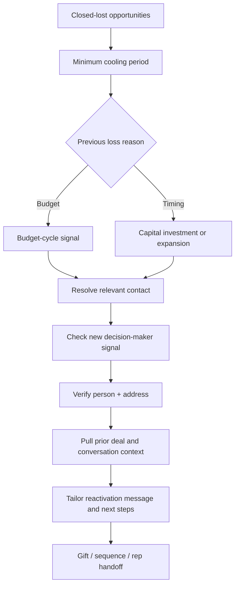

# Closed-Lost Reactivation System

**Revive dormant opportunities when a meaningful buying condition changes.**

## The problem

A closed-lost deal is not necessarily a permanently lost account. Timing, investment approval, leadership changes or expansion can make an earlier conversation newly relevant. The challenge is to find the right accounts without sending generic "checking in" messages.

## System flow

## How the decisions work

**Eligibility:** The sample starts with a 60-day floor before reconsidering a closed-lost opportunity.

**Trigger selection:** A budget-related loss enters a 9–11 month planning-window proxy. Timing-related losses are assessed against expansion or capital-investment activity. A new person in a decision-making role is an additional change signal.

**Contact resolution:** The design checks whether the original buyer is still relevant, or whether a successor or newly hired stakeholder needs to be found. Enrichment and address verification are used as pre-send checks.

**Activation:** The proposed handoff brings together loss reason, prior deal context, conversation insights, personalized messaging, gifting and outbound follow-up.

## The bigger idea

This is **signal-led pipeline recycling**: spend acquisition effort when an account's circumstances have changed and provide the rep with the reason to re-engage. The n8n file captures the early architecture, including placeholder provider integrations and an illustrative AI-copy stage.

[Inspect architecture JSON](../workflows/closed-lost-reactivation-architecture.json) · [← Acquisition systems](../acquisition/README.md)
