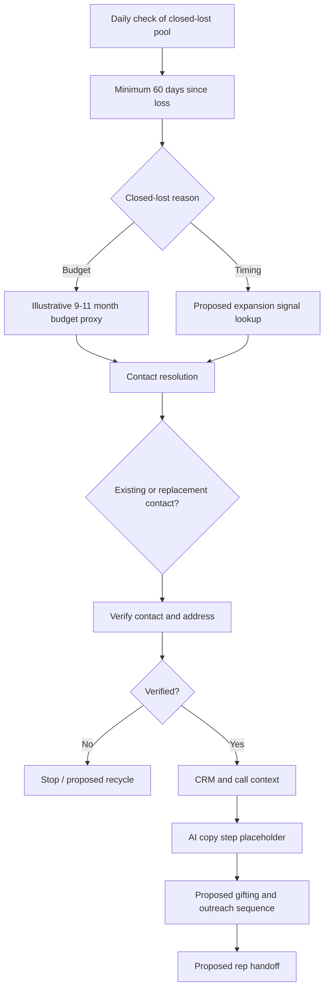

# 02 / Closed-Lost Reactivation Architecture

**Status:** Inactive architecture prototype with incomplete provider configuration and deliberately disabled external HTTP destinations. Not an executed campaign.

## Intent
Reactivate closed-lost manufacturing accounts only when a meaningful change suggests the earlier obstacle may have shifted. The model separates eligibility, new signals, contact quality and outreach orchestration.

## Boundaries

- CRM stage and closed-lost-reason filters need real field mappings.
- A budget-cycle proxy is not proof of an approved purchasing budget.
- Expansion/new-hire lookups were designed against illustrative provider routes, not tested endpoints.
- Employment and address verification are proposed safety gates, not proof of live checks.
- The AI step produces literal placeholder strings; **no LLM is invoked**.
- Gifting, sequence enrollment, and downstream rep updates require integration, consent and spend controls.
- Event ordering, deduplication, branch reconciliation, error handling and delivery correlation remain engineering tasks.

[Back to overview](../README.md) · [Implementation notes](technical-notes.md)
