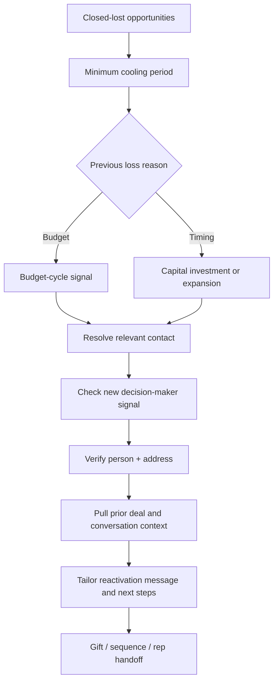

# Closed-Lost Reactivation System

**Revive dormant opportunities when a meaningful buying condition changes.**

## Full campaign architecture · 38 slides

The complete **Wake the Dead** campaign deck is available below, including the signal framework, Clay architecture, contact verification, AI reasoning, gifting sequence, rep handoff, reporting and technical appendix. 

**[Open the full 38-slide presentation](https://docs.google.com/presentation/d/1drJXUSyPldEuzAOHPYU0H4OzSgr6lbR6QMccOOud44Q/preview)**

<strong>View all 38 slides inline (expand)</strong>

**01. WAKE THE DEAD**

**02. The Motion End to End**

**03. Building the Intent-Based Audience**

**04. What Counts as a Signal to “Wake” an Account?**

**05. Intent Scoring Engine**

**06. SQL Stage Map….  Dormant → SQL**

**07. Tech Stack**

**08. The Growth Tech Stack**

**09. Technical Handoffs**

**10. Contact Verification & AI Workflows**

**11. Is the Champion Still There?**

**12. AI's Job: Set Variables Vs Making the Call**

**13. AI Reads the Loss — Then Checks If It Still Holds**

**14. How AI Turns Signals Into Outreach**

**15. Gifting & Sales Alignment**

**16. Gift & Outreach Complimenting Each Other**

**17. Gifting Selection Rationale - Base on What We Know**

**18. What the ADR Sees**

**19. Reporting & Iteration**

**20. What Success Looks Like and How We'd Benchmark It**

**21. The Weekly Readout**

**22. Iteration Cadence**

**23. Appendix**

**24. AI Reads the Reason for Loss**

**25. Does the Blocker Still Hold?**

**26. Director of Operations: Ranked by Lowest Assumed Miss Rate**

**27. Data Handoff Map — Intake Through the Qualification Gate**

**28. Data Handoff Map — Enrichment & AI Reasoning in Table 2**

**29. Data Handoff Map — Gifting Through Outreach**

**30. Closed-Loop Reporting — Qualification & Enrichment Fields**

**31. Closed-Loop Reporting — Gift, Delivery & Funnel Fields**

**32. Signal Synthesis — Summarizing Each Source**

**33. Signal Synthesis — One Narrative From Four Inputs**

**34. Email 1 — Signal + Address Confirmation**

**35. Email 2 — Asking for time**

**36. What's in the Clay Tables**

**37. The Gift and the Outreach Are Triggered by the Same Event**

**38. The ROI Framework**

---

## The problem

A closed-lost deal is not necessarily a permanently lost account. Timing, investment approval, leadership changes or expansion can make an earlier conversation newly relevant. The challenge is to find the right accounts without sending generic "checking in" messages.

## System flow

## How the decisions work

**Eligibility:** The sample starts with a 60-day floor before reconsidering a closed-lost opportunity.

**Trigger selection:** A budget-related loss enters a 9–11 month planning-window proxy. Timing-related losses are assessed against expansion or capital-investment activity. A new person in a decision-making role is an additional change signal.

**Contact resolution:** The design checks whether the original buyer is still relevant, or whether a successor or newly hired stakeholder needs to be found. Enrichment and address verification are used as pre-send checks.

**Activation:** The proposed handoff brings together loss reason, prior deal context, conversation insights, personalized messaging, gifting and outbound follow-up.

## The bigger idea

This is **signal-led pipeline recycling**: spend acquisition effort when an account's circumstances have changed and provide the rep with the reason to re-engage. The n8n file captures the early architecture, including placeholder provider integrations and an illustrative AI-copy stage.

[Inspect architecture JSON](../workflows/closed-lost-reactivation-architecture.json) · [← Acquisition systems](../acquisition/README.md)
