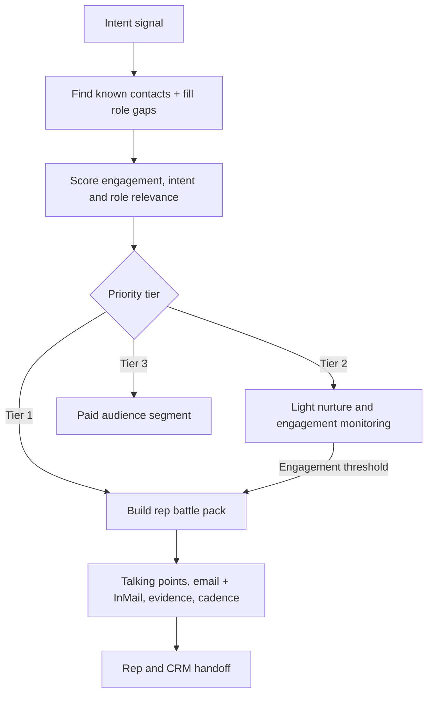

# Rep Empowerment Engine

**Intent-based prospecting → contact prioritization → rep-ready action.**

## The problem

Account-level intent alone rarely tells a seller which person to prioritize or how to approach them. This workflow combines account signals and individual engagement to turn an alert into a usable plan for the rep.

## The workflow

## Decision logic

Contacts are ranked using **engagement behavior, account-level intent and role fit**. In this early iteration, the heuristic is:

`Score = 2 × email opens + 5 × clicks + 4 × site visits + 0.3 × account intent + role weight`

Tier 1 starts at **45**, Tier 2 at **20**, and Tier 3 is below **20**. The principle is to **prioritize demonstrated interest**, with title fit informing rather than overruling the decision.

## What the rep receives

A high-priority lead has the beginnings of a complete working brief:

- Talking points tied to the observed signal and likely role priorities
- Email and LinkedIn outreach drafts
- A relevant proof point or case-study match
- Day-by-day recommended contact cadence
- A handoff summary for sales action

The underlying n8n export includes the conditional routing and representative processing logic. The external CRM, enrichment and messaging steps in this sample are simulated.

[Inspect workflow JSON](../workflows/rep-empowerment-demo.json) · [← Acquisition systems](../acquisition/README.md)
