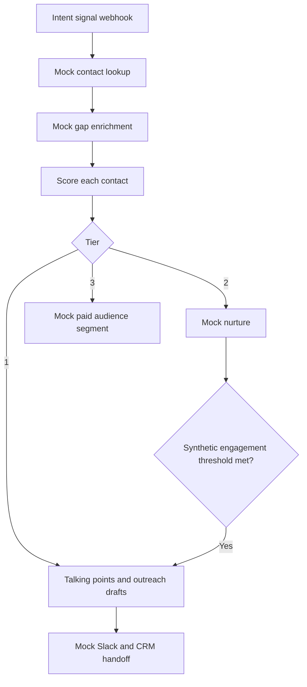

# 01 / Rep Empowerment Engine

**Status:** Synthetic, inactive n8n prototype. Not a deployed integration.

## Flow
1. A webhook represents incoming account intent.
2. Mock HubSpot contact lookup and Clay enrichment build a contact set.
3. Each contact receives a deterministic score based on behavior, intent and role.
4. Tier 1 generates a rep-ready packet; Tier 2 enters simulated nurture and can be promoted; Tier 3 is represented as an ad-audience record.

## Scoring

`engagement = 2 × email opens + 5 × email clicks + 4 × site visits`

`total = engagement + (account intent strength × 0.3) + role-fit weight`

Role-fit weights: Reliability Engineer 10, Maintenance Manager 8, Plant Manager 6, otherwise 5. Tier 1 total ≥ 45; Tier 2 ≥ 20 and < 45; Tier 3 < 20.

**This is a heuristic, not a predictive model.** The Tier 2 engagement increment is simulated, not a live event subscription.

## Outputs and limitations

Tier 1 constructs plain-language phone talking points, templated email and LinkedIn drafts, a sample case-study match, a call sequence and mock Slack / CRM payloads. No messages are actually sent. The email copy is generated by templates rather than by an LLM.

The CRM, enrichment, Slack, sequence enrollment and audience integrations are mocked. The workflow lacks production event ingestion, durable state, retries, observability, deduplication and compliance controls.

[Back to overview](../README.md) · [Implementation notes](technical-notes.md)
