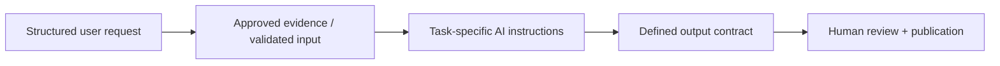

# AI enablement assistants

**Focus:** Translating repeated sales and marketing tasks into reusable, bounded AI-assistant workflows.

These five selections are **portfolio summaries adapted from an internal AI tool catalog**. The original enterprise ChatGPT configurations, system instructions, reference materials and live tool access are **not** included here. The writeups describe documented capabilities and design patterns; they do **not** provide runnable replicas or prove individual execution results.

## Choose an example

| Role / Job to be done | Assistant design | Engineering pattern |
|---|---|---|
| **Account executives** · Prepare for account outreach | [Account Strategy Copilot](account-strategy-copilot.md) | Research → role mapping → structured deliverables |
| **BDRs** · Prioritize a researched outreach angle | [Signal-Led BDR Research](signal-led-bdr-research.md) | Recent signal sourcing → proof matching → concise email |
| **Marketing + sales** · Find credible proof | [Evidence-Grounded Messaging](evidence-grounded-messaging.md) | Approved-source retrieval → claim traceability |
| **Sales engineering / proposals** · Respond to RFPs | [Source-Grounded RFP Responses](source-grounded-rfp-responses.md) | Question extraction → retrieval → answer + confidence |
| **Demand generation** · Build event lifecycle emails | [Webinar Lifecycle Campaigns](webinar-lifecycle-campaigns.md) | Campaign brief → audience segments → six drafts |

## The common design philosophy

Each design illustrates a different form of constraint: cited sources, explicit required inputs, role-specific adaptations, strict output shape, or stop-and-escalate behavior when evidence is insufficient.

### See the ideas applied

[Read a synthetic example of source-grounded outreach and missing-evidence handling](DEMO-GUIDE.md). This is an illustrative input/output exercise, not an output from the original enterprise tools.

### Important boundaries
- These are **documented internal tool concepts**, not exported GPT definitions.
- Any sample output is illustrative and synthetic. No internal customer, product or knowledge files are redistributed.
- The underlying business capability and adoption outcomes cannot be independently verified from the catalog alone.
- The catalog contains 22 listed tools; this page curates five different enablement patterns rather than publishing its full directory.

[← Portfolio home](../README.md)
