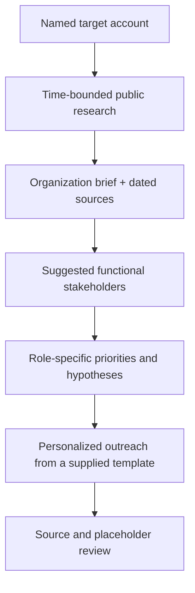

# Account Strategy Copilot

**Function:** Sales enablement / account-based prospecting  

## Business problem
Preparing a relevant first conversation requires a current account brief, plausible buying-committee coverage, role-specific strategy and outreach. Those deliverables are often built in separate steps and lose context between handoffs.

## Workflow model

## Input contract
- Target account; optional target personas and initiatives
- Optional contact list for known recipients
- **User-supplied email template** for outreach generation

## Expected outputs
1. Organization brief: dated research bullets with sources
2. Suggested contacts: names/functions with provenance and confidence where available
3. Strategy by contact: relevant problem hypotheses and opening angles
4. Personalized email drafts preserving the user's template structure

## Design decisions / safeguards
- Separate **verified account facts** from **sales hypotheses**.
- Use current, attributable sources for research; do not fabricate initiatives, contact details or customer claims.
- Preserve unresolved placeholders in outreach rather than inserting unsupported facts.
- Maintain a stable output sequence so an AE can review the package quickly.

## GTM value

Combines account research, stakeholder hypotheses, outreach strategy and template-led personalization into one seller-ready preparation workflow. The primary benefit is **better account context and less fragmented prep work** before prospecting begins.
[← Sales systems](../sales/README.md)
