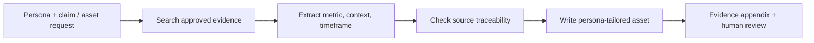

# Evidence-Grounded Messaging

**Portfolio adaptation of:** “QGenda Evidence Assistant” in the AI Tool Library  
**Category:** Knowledge retrieval / sales and marketing enablement  
**Artifact status:** Documented design, not a working GPT export

## Business problem
Teams need to find the right case study and cite it correctly without inventing impressive-sounding metrics or reusing proof outside the relevant context.

## Workflow model

## Input contract
- Task: objection response, messaging brief, proof table, email or one-page outline
- Persona, segment and desired outcome
- Authoritative case studies and product facts, **not distributed here**

## Expected outputs
- Evidence snapshot with verifiable metrics and context
- Persona-relevant asset with claims tied to sources
- Explicit evidence appendix mapping statements back to the original source

## Design decisions / safeguards
- Every number, outcome, quotation or superlative requires a verifiable citation.
- Preserve direct quotation exactly; do not infer or fabricate results.
- Surface insufficient, contradictory or missing evidence for review rather than forcing a claim.
- Separate evidence retrieval from persuasive copywriting.

## What this demonstrates
Retrieval-grounded content design, auditability, source hygiene and communication of evidence confidence. **A catalog description is not a live retrieval or citation-validation test.**

[← AI enablement index](README.md)
