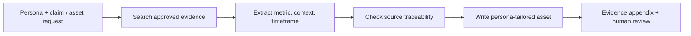

# Evidence-Grounded Messaging

**Function:** Knowledge retrieval / sales and marketing enablement  

## Business problem
Teams need to find the right case study and cite it correctly without inventing impressive-sounding metrics or reusing proof outside the relevant context.

## Workflow model

## Input contract
- Task: objection response, messaging brief, proof table, email or one-page outline
- Persona, segment and desired outcome
- Authoritative case studies and product facts

## Expected outputs
- Evidence snapshot with verifiable metrics and context
- Persona-relevant asset with claims tied to sources
- Explicit evidence appendix mapping statements back to the original source

## Design decisions / safeguards
- Every number, outcome, quotation or superlative requires a verifiable citation.
- Preserve direct quotation exactly; do not infer or fabricate results.
- Surface insufficient, contradictory or missing evidence for review rather than forcing a claim.
- Separate evidence retrieval from persuasive copywriting.

## GTM value

Turns scattered proof assets into a **source-grounded messaging resource**. Sales and marketing can find relevant evidence, see the context behind a claim and adapt it to buyer priorities without re-researching every use case.
[← Sales systems](../sales/README.md)
