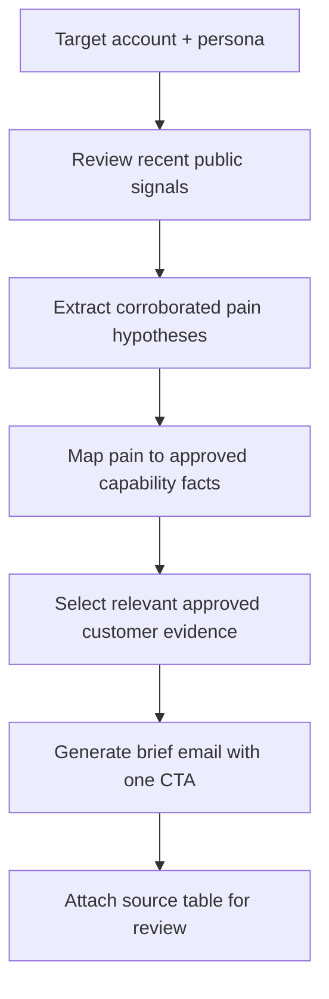

# Signal-Led BDR Research

**Function:** Sales prospecting / evidence-based personalization  

## Business problem
BDR personalization is often either generic or overconfident. The assistant is designed to identify **recent, attributable account signals**, connect them to plausible business pains and create a short, evidence-backed opening email.

## Workflow model

## Input contract
- Account and target role or persona
- Current public-source access for time-sensitive facts
- Approved product facts and approved proof library

## Expected outputs
- Concise outreach email with a relevant reason to reach out
- Traceable account-signal/pain table, with dates and sources
- Selected proof example, only when a verifiable match exists

## Design decisions / safeguards
- Source-dependent claims must be attributable; account research is not evidence of a buyer's private intent.
- Do not invent customer outcomes, metrics or quotes.
- Distinguish a researched signal from an **inferred** business problem.
- Use a single clear meeting ask; no hard-coded or undisclosed private data.

## GTM value

Connects the reason to reach out with public evidence, likely buyer priorities and relevant customer proof. This gives BDRs a **structured, signal-led research process** rather than relying on generic personalization.
[← Sales systems](../sales/README.md)
