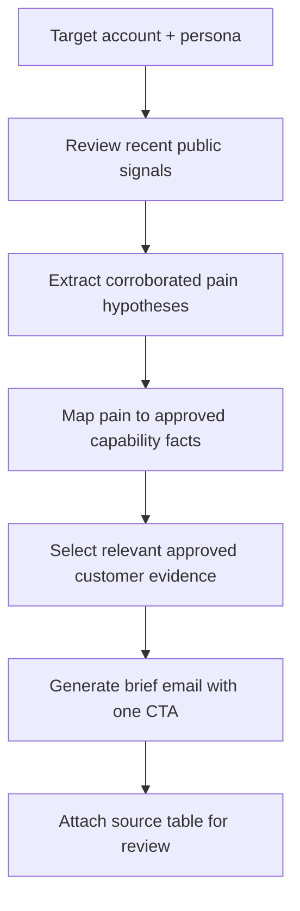

# Signal-Led BDR Research

**Portfolio adaptation of:** “BDR Outreach Assistant (Account Research)” in the AI Tool Library  
**Category:** Sales prospecting / evidence-based personalization  
**Artifact status:** Documented design, not a working GPT export

## Business problem
BDR personalization is often either generic or overconfident. The assistant is designed to identify **recent, attributable account signals**, connect them to plausible business pains and create a short, evidence-backed opening email.

## Workflow model

## Input contract
- Account and target role or persona
- Current public-source access for time-sensitive facts
- Approved product facts and approved proof library, **not** supplied in this repository

## Expected outputs
- Concise outreach email with a relevant reason to reach out
- Traceable account-signal/pain table, with dates and sources
- Selected proof example, only when a verifiable match exists

## Design decisions / safeguards
- Source-dependent claims must be attributable; account research is not evidence of a buyer's private intent.
- Do not invent customer outcomes, metrics or quotes.
- Distinguish a researched signal from an **inferred** business problem.
- Use a single clear meeting ask; no hard-coded or undisclosed private data.

## What this demonstrates
A practical signal → hypothesis → proof → messaging pipeline. **No real-time scraping, CRM integration or successful delivery is demonstrated by the uploaded catalog.**

[← AI enablement index](README.md)
