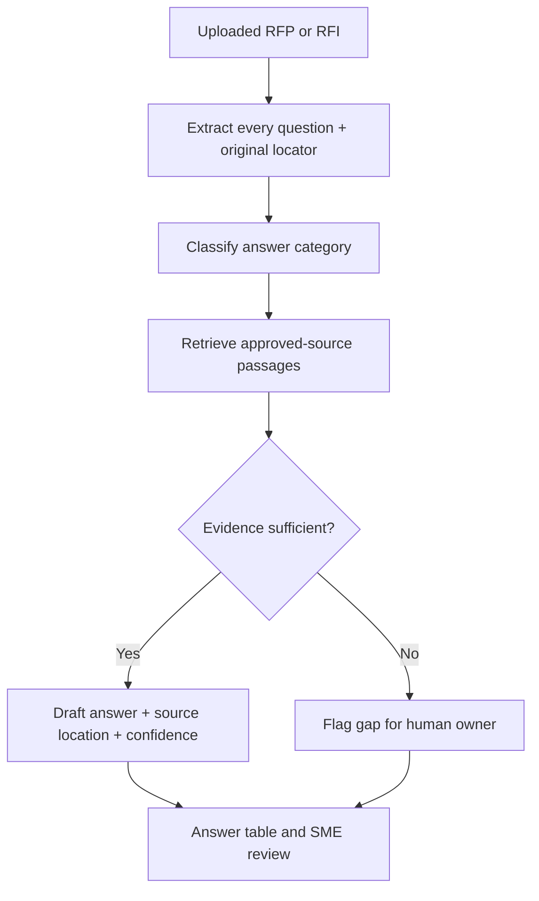

# Source-Grounded RFP Responses

**Function:** Proposal response automation / retrieval and review  

## Business problem
RFP responses require exhaustive coverage of questions and defensible answers. Unsupported claims can create security, procurement and commercial risk.

## Workflow model

## Input contract
- RFP/RFI files with section IDs
- Approved answer bank and authoritative security/product documentation
- Optional response requirements and human review routing

## Expected outputs
A structured answer table containing original question ID, source-backed response, citation location and confidence, with unsupported items clearly flagged.

## Design decisions / safeguards
- Preserve original RFP numbering so reviewers can reconcile the response.
- Use approved internal documents only; no unsupported product or security claims.
- Reference source location for every material fact.
- Treat confidence as a **review signal**, not proof of factual correctness.
- Do not hallucinate missing security/compliance answers.

## GTM value

Creates a more repeatable proposal workflow: extract every requirement, retrieve authoritative support, draft structured answers and route evidence gaps to the right owner. The emphasis is **response completeness, traceable proof and faster SME review**.
[← Sales systems](../sales/README.md)
