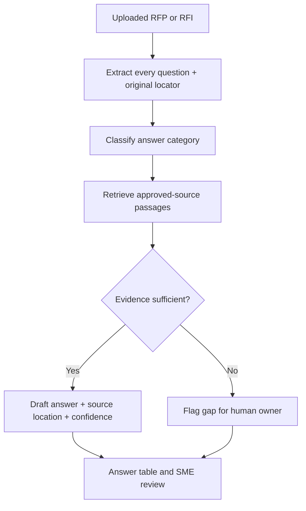

# Source-Grounded RFP Responses

**Portfolio adaptation of:** An internal, source-grounded RFP/RFI response assistant  
**Category:** Proposal response automation / retrieval and review  
**Artifact status:** Documented *functional prototype* in the source catalog; implementation files not provided here

## Business problem
RFP responses require exhaustive coverage of questions and defensible answers. Unsupported claims can create security, procurement and commercial risk.

## Workflow model

## Input contract
- RFP/RFI files with section IDs
- Approved answer bank and authoritative security/product documentation
- Optional response requirements and human review routing

## Expected outputs
A structured answer table containing original question ID, source-backed response, citation location and confidence, with unsupported items clearly flagged.

## Design decisions / safeguards
- Preserve original RFP numbering so reviewers can reconcile the response.
- Use approved internal documents only; no unsupported product or security claims.
- Reference source location for every material fact.
- Treat confidence as a **review signal**, not proof of factual correctness.
- Do not hallucinate missing security/compliance answers.

## What this demonstrates
Document parsing, evidence retrieval, structured generation and review governance. The catalog labels the original as a **functional prototype**, but no tests, source files or executable GPT export were supplied for this portfolio.

[← AI enablement index](README.md)
