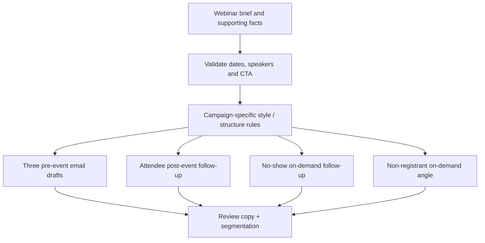

# Webinar Lifecycle Campaigns

**Portfolio adaptation of:** “Webinar Email Promotions” in the AI Tool Library  
**Category:** Demand generation / campaign enablement  
**Artifact status:** Documented design, not a working GPT export

## Business problem
Webinar follow-up demands consistent pre-event promotion while recognizing that attendees, no-shows and non-registrants need different messaging afterward.

## Workflow model

## Input contract
- Webinar description, audience, dates, speakers, takeaways and relevant URLs
- Approved tone and layout rules, **not distributed here**
- Optional on-demand information for post-event campaigns

## Expected outputs
**Exactly six email drafts:** three pre-event and three segment-specific post-event versions. Each follows a consistent output structure (subject, preview, body, CTA and standard sections).

## Design decisions / safeguards
- Enforce a defined content contract to reduce variation between campaigns.
- Do not invent event dates, speaker details or performance proof.
- Clearly mark unresolved inputs for human confirmation.
- Distinguish drafted campaign content from **actual marketing automation**: audience selection, scheduling and email sends are not demonstrated by the GPT catalog.

## What this demonstrates
Repeatable content operations, persona and lifecycle segmentation, structured generation and marketing quality controls.

[← AI enablement index](README.md)
