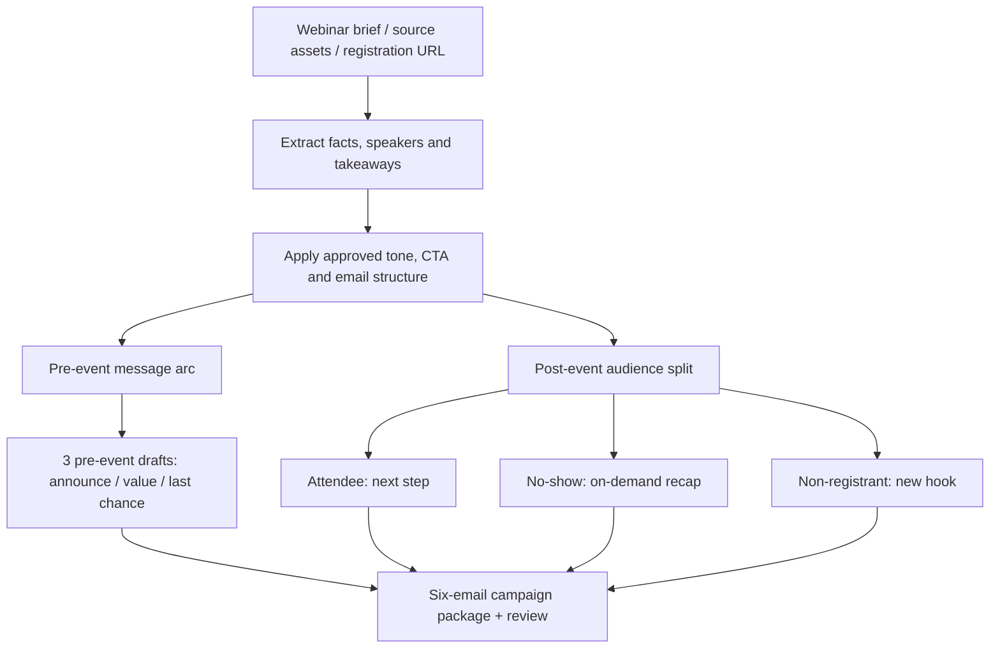

# Segmented Webinar Lifecycle Campaign Assistant

**Function:** Webinar demand generation, campaign operations and nurture strategy  
**Source basis:** Webinar Email Promotions tool card  
**Artifact type:** Documented assistant design

## Problem

A webinar is a multi-stage lifecycle program. The message that wins a registration is different from what an attendee, no-show or non-registrant should receive afterward. Rebuilding every message individually increases handoff overhead and can create inconsistent offers.

## Designed workflow

## What it actually delivers

A **six-email package** from a single webinar brief, URL or supporting document, with three coordinated pre-event messages and three post-event audience-specific messages. Each uses an exact output structure with subject line, preview text, body, three bullets, CTA and a standard module. The tool card specifies a narrative arc and audience-specific CTA handling, including on-demand links.

## Operational value

The benefit is **standardized lifecycle coverage and cleaner campaign production**: field/content teams supply a common brief, demand generation gets a consistent sequence, and the post-event variations have a clear rationale based on recipient behavior. This creates reusable campaign logic rather than six isolated pieces of writing.

The source catalog describes **draft generation only**. It does not show event registration tracking, audience segmentation inside a marketing automation platform, triggered sends or campaign performance.

**Suggested evaluation:** Time from webinar brief to approved lifecycle package, changes required before launch, audience-specific conversion rate and influenced pipeline measured downstream.

[← Marketing portfolio](../marketing/README.md)
