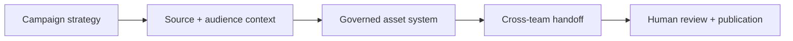

# Marketing AI Systems

A cross-functional portfolio of **how AI supports marketing operations, not just content drafting**. These designs span conversion strategy, paid acquisition, organic growth, product marketing, event activation and content distribution.

> **Evidence level:** These case studies are based on individual Tool Cards from an internal AI Tool Library. They describe assistant inputs, decision rules and intended outputs. The original GPT configurations and implementation files are not included here; measured results are not inferred.

## Featured systems

| System | What it operationalizes | Handoff |
|---|---|---|
| **[GEO + SEO Content Production](geo-seo-content.md)** | Content architecture gate, source recency and citation governance, internal-link planning and QA | **Editorial + web team:** full article, SEO/OG metadata, URL slug, links and checklist |
| **[Conversion Landing Pages](landing-page-architecture.md)** | Campaign objectives into rule-governed page modules, proof dependencies and reviewable layouts | **Design + web team:** executive snapshot, wireframe, asset map and visual preview |
| **[Trade Show GTM Campaigns](trade-show-campaigns.md)** | One event brief into a coordinated pre-/post-show marketing and sales campaign | **Field + demand gen + BDR + AE:** emails, landing page, sequences, follow-up and QA |
| **[Knowledge-Grounded Product Marketing](product-messaging-system.md)** | Maintain authoritative, persona-specific messaging across five product families | **Marketing + sales:** defensible value messaging, objections, proof and channel adaptations |
| **[Webinar Content Repurposing](webinar-content-repurposing.md)** | Transcript insights into a reusable set of derivative assets and customer language | **Content + lifecycle + social + video:** blogs, emails, FAQs, social, quotes and clip briefs |

## Channel-specific execution tools

| System | Distinctive role |
|---|---|
| [Paid Media Message Testing](paid-search-copy.md) | Seven channel-aware creative hypotheses with length and claims controls |
| [LinkedIn Landing-Page Alignment](linkedin-ad-creative.md) | Infer conversion objective from destination page, then construct matching ad fields |
| [Webinar Lifecycle Campaigns](../enablement/webinar-lifecycle-campaigns.md) | Six-email campaign architecture with separate post-event messaging for attendees, no-shows and non-registrants |
| [Employee Advocacy Distribution](employee-advocacy.md) | Reuse approved assets in four controlled social formats for employees |

## Across the marketing lifecycle

### Where the engineering thinking shows up

- **Content architecture:** Format selection logic, page-module rules and campaign structure.
- **Knowledge governance:** Approved source hierarchy, claim and numerical-proof restrictions, source freshness and citation policy.
- **Structured deliverables:** Defined outputs, character limits, source metadata, asset dependencies and acceptance checklists.
- **Orchestration design:** Handing a consistent campaign strategy to field marketing, web, demand gen, BDRs, AEs and content teams.
- **Measurement readiness:** Suggested quality, turnaround and downstream performance indicators, clearly separated from any demonstrated business results.

[← Portfolio overview](../README.md) · [Sales AI systems →](../sales/README.md)
