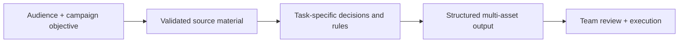

# Marketing AI Systems

A cross-functional set of tools designed to turn campaign strategy, source material and brand knowledge into **coordinated marketing execution**. The emphasis is on repeatable processes, quality controls and cleaner handoffs across teams.

## Campaign and content systems

| System | What it solves | Downstream impact |
|---|---|---|
| **[GEO + SEO Content System](geo-seo-content.md)** | Content structure, authoritative sourcing, full article development and QA | **Web team** receives article, metadata, internal links and publishing checklist in one package |
| **[Landing Page Architecture](landing-page-architecture.md)** | Conversion strategy, page modules, proof and asset requirements | **Design/web** receives wireframe, copy, asset map and visual preview |
| **[Trade Show GTM Campaigns](trade-show-campaigns.md)** | Coordinated messaging before and after field events | **Demand gen, field, BDR and AE** receive aligned campaign assets and meeting CTAs |
| **[Product Messaging System](product-messaging-system.md)** | Consistent positioning and source-backed messaging across product families | **Sales and marketing** work from the same approved product narrative |
| **[Webinar Repurposing](webinar-content-repurposing.md)** | Translate a transcript into reusable ideas and channel-specific assets | **Content, social, lifecycle and video** receive a structured asset plan |

## Paid acquisition and distribution

| System | Capability |
|---|---|
| [Paid Media Message Testing](paid-search-copy.md) | Produce distinct channel-aware creative angles with controlled claims and field lengths |
| [LinkedIn Ad Alignment](linkedin-ad-creative.md) | Derive the right conversion promise and CTA from the landing page |
| [Webinar Lifecycle Campaigns](../enablement/webinar-lifecycle-campaigns.md) | Build three pre-event messages and segmented follow-up for attendees, no-shows and non-registrants |
| [Employee Advocacy](employee-advocacy.md) | Equip employee networks with accurate, format-varied promotion of approved assets |

## Common operating model

These systems take repetitive work out of campaign production while protecting message quality, creating clearer deliverable requirements and making more of each source asset.

[← Portfolio home](../README.md) · [Sales systems →](../sales/README.md)
