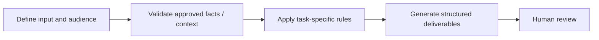

# Employee Advocacy Posts

**Portfolio category:** Marketing · Social / advocacy  
**Source catalog entry:** Advocacy Post Generator  
**Status:** Documented AI assistant design from an internal tool directory. No enterprise GPT configuration, reference documents, credential access or runnable implementation is included.

## Purpose
Four LinkedIn post formats: conversational invite, question-led, data snapshot and newsbite.

## Workflow concept

## Inputs
Approved source asset and format examples.

## Documented output
Four LinkedIn post formats: conversational invite, question-led, data snapshot and newsbite.

## What the design emphasizes
Employee-ready drafts with repeatable formats; not published posts.

## Implementation and evidence boundaries
This case study summarizes a catalog description, rather than reproducing proprietary system instructions or knowledge files. It does not independently demonstrate that the original assistant ran successfully, was integrated into marketing systems, or improved campaign performance. Actual prompts, files and outcomes have not been supplied for public reproduction.

[← Marketing index](README.md) · [← Portfolio home](../README.md)
