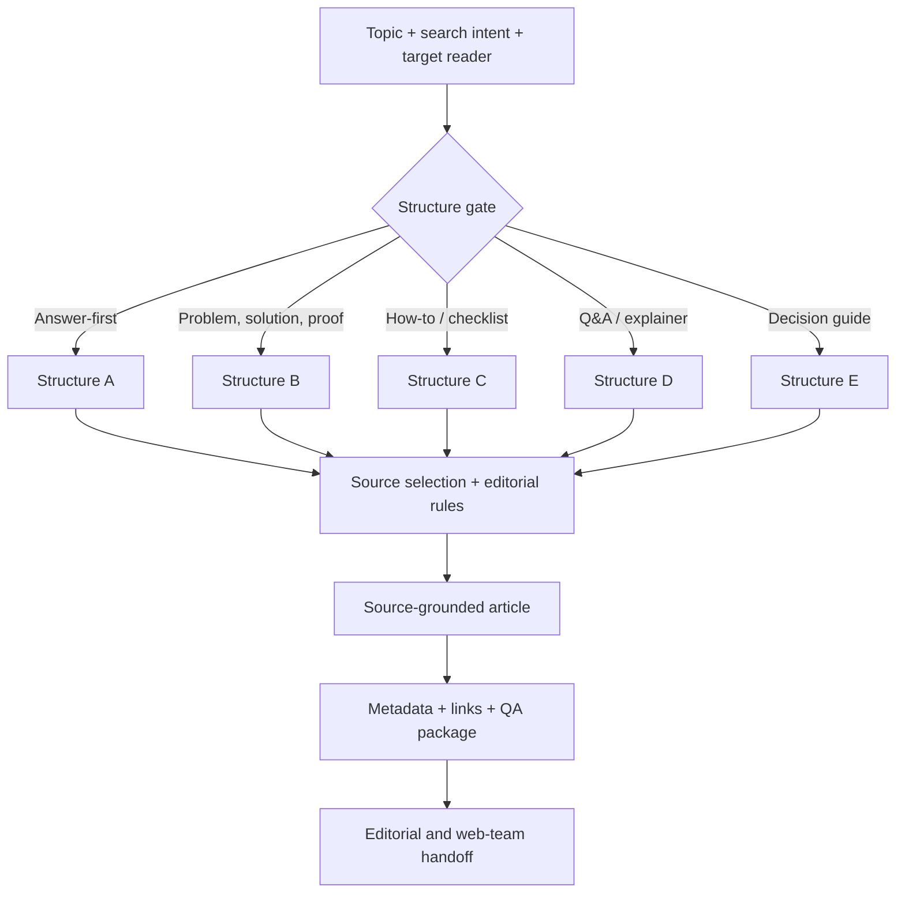

# GEO + SEO Content Production System

**Function:** Organic acquisition, editorial operations and web publishing  
**Source basis:** GEO Blog Generator & Optimizer tool card  
**Artifact type:** Documented assistant design; original internal instructions and source files are not distributed

## The operational challenge

A search article is not finished when the draft is written. Teams must decide **which format best serves the query**, validate sources and claims, map internal links, maintain consistency with the brand, prepare page-level metadata, and give the web team a clean publishing package. Fragmented handoffs create unnecessary rework and inconsistent quality.

## System design

### 1. Content architecture before drafting
The assistant selects from **five approved editorial structures**: Answer-First, Problem → Solution → Proof, How-To + Checklist, Q&A Explainer, and Decision Guide. A structure-selection gate recommends the best fit when not specified, and the chosen template defines required sections. The draft uses an executive summary, key points, scannable sections, optional tables, and a CTA.

### 2. Source quality and claim governance
The tool card specifies an explicit sourcing policy:
- Use **recent sources (generally within 24 months)** and verify recency.
- Keep **at least 70%** of external sources primary or official.
- Limit outbound sources to **10**, with descriptive in-sentence citations and direct URLs.
- Flag unsupported claims as **[citation needed]** rather than inventing evidence when browsing is unavailable.
- Work within the requested word count (±10%) and reading-level requirements.

These are **designed rules**, not a claim that every real-world output has been independently audited.

### 3. Publishing-ready deliverable set

| Deliverable | What the downstream team receives |
|---|---|
| **BLOG_POST** | Structured Markdown draft with summary, key points, source citations and CTA |
| **METADATA** | SEO title (≤60 characters), meta description (≤155), slug, Open Graph title and description, and OG image concept |
| **INTERNAL_LINKS** | 3–6 suggested links drawn from a supplied internal-link pool, or flagged placeholders |
| **OUTBOUND_SOURCES** | Attributed, directly linked sources supporting cited claims |
| **QA_CHECKLIST** | Pass/fail review of structural, sourcing, length and metadata requirements |

**Web-team handoff:** The editor and web team receive the *content and the publishing metadata together*, rather than rebuilding the URL, SERP snippet, social-sharing copy and linking plan after writing is complete. The tool card specifies the fields above; it does not claim to implement CMS publication, canonical tags or live ranking measurement.

## Business value and measurement

**Designed leverage:** Reduce repetitive content-production and handoff work; create more consistent content structures; and make source verification, metadata completion and internal linking part of the process rather than downstream clean-up.

**How to evaluate:** First-draft acceptance, time from brief to CMS-ready package, metadata completeness, citation/claim audit pass rate, editorial revisions and, after publishing, organic visibility, qualified traffic and conversions. *These are proposed evaluation measures, not reported results.*

## Implementation boundary

This page describes the documented workflow and requirements of an internal assistant. The original knowledge files (structure definitions, sourcing policy, selection heuristics), live browsing outputs and production performance data are not available in this repository.

[← Marketing portfolio](README.md)
