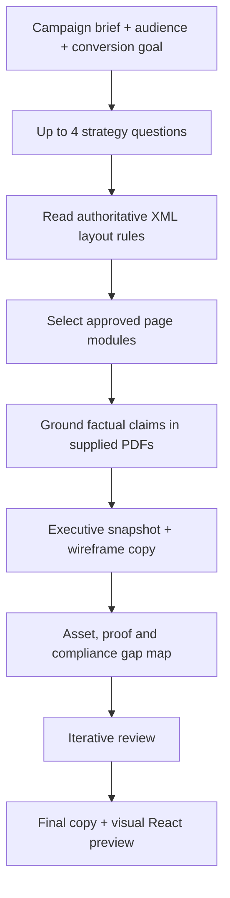

# Conversion Landing-Page System

**Function:** Conversion rate optimization, campaign production and design handoff  

## The operational challenge

Marketing briefs, design decisions and proof assets often reach the web team separately. That leads to inconsistent page structure, unverified claims and late requests for testimonials, visual assets or form requirements. This assistant is designed to **move from campaign objective to a governed, reviewable page specification**.

## Designed workflow

### Decision system rather than free-form generation

The system uses an **XML-governed page architecture**, with a module palette, module-selection rules, page-layout constraints, CTA templates, form specifications and file-request templates. Those rules define which sections are appropriate for a given campaign and what information is required before the page is considered ready.

The assistant asks targeted questions about audience, offer and conversion goal, then selects from permitted modules such as use cases, comparison or social proof. The user-supplied PDFs are the authority for product claims, metrics and customer evidence.

### Reviewable deliverables

1. **Executive snapshot:** Who the page targets, what the page asks them to do, and the rationale for the approach.
2. **Section-by-section wireframe copy:** Hero, core value argument, selected proof and conversion path through final CTA.
3. **Asset map:** Required images, proof points, case studies, testimonials, logos, and compliance checks, with gaps called out.
4. **Revision and approval loop:** Updated copy aligned to the structural rules rather than unbounded rewrites.
5. **Visual React preview:** An illustrative page preview so stakeholders can react to hierarchy and flow before implementation.

### Why that matters

The intended value is **clearer campaign-to-web handoff**: marketing can provide a conversion hypothesis, copy, page architecture, form/CTA direction and a list of required assets in one package. Design and web teams can resolve missing dependencies earlier.

The tool expressly uses placeholders where proof is missing. It prohibits invented results, testimonials and clinical claims. 

**Performance measures:** Brief-to-approved-wireframe time, late-stage asset requests, design revision cycles, form completion and post-launch conversion rates. 

[← Marketing portfolio](README.md)
