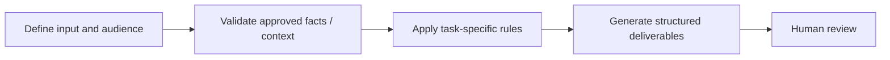

# Landing Page Architecture

**Portfolio category:** Marketing · Conversion optimization  
**Source catalog entry:** Landing Page Generator  
**Status:** Documented AI assistant design from an internal tool directory. No enterprise GPT configuration, reference documents, credential access or runnable implementation is included.

## Purpose
Strategy clarifications, conversion-oriented wireframe, final landing-page copy and a canvas preview.

## Workflow concept

## Inputs
Uploaded source PDFs and campaign intent.

## Documented output
Strategy clarifications, conversion-oriented wireframe, final landing-page copy and a canvas preview.

## What the design emphasizes
Source-grounded copy, questions before drafting, no invented claims.

## Implementation and evidence boundaries
This case study summarizes a catalog description, rather than reproducing proprietary system instructions or knowledge files. It does not independently demonstrate that the original assistant ran successfully, was integrated into marketing systems, or improved campaign performance. Actual prompts, files and outcomes have not been supplied for public reproduction.

[← Marketing index](README.md) · [← Portfolio home](../README.md)
