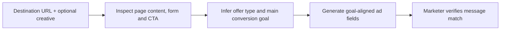

# Landing-Page-Aligned LinkedIn Ad Assistant

**Function:** Paid social, campaign conversion continuity  
**Source basis:** LinkedIn Ad Assistant tool card  
**Documented design:** Goal inference and structured ad-ready fields

## Problem

Ads underperform when their offer, CTA and promise do not match the destination page. This assistant uses the **landing page itself** to determine which conversion action the ad should support before it drafts creative.

## Design mechanics

The tool card describes page analysis for offer type (webinar, report, demo, trial), implied audience, core value promise, forms and CTA verbs. It then returns a structured **Final Ad Deliverables** package:

| Deliverable | Constraint |
|---|---|
| Introductory text | Up to 150 characters; full sentences; concrete benefit and matching CTA |
| Headline | Target ≤55 characters; aligned to offer and value promise |
| Description | Up to 150 characters; complements the headline |
| Image alt text | Up to 300 characters if an image is provided; otherwise a clear absence notice |

Its value is **ad-to-landing-page consistency** and a defined handoff to paid media production, rather than just producing attractive wording. It avoids invented metrics and is expected to handle inaccessible pages explicitly.

**Scope:** One ad deliverable set from one page. No campaign deployment, pixel validation, funnel measurement or real-time ad optimization is demonstrated.

**Suggested evaluation:** Ad/page message-match review, revisions to approval, accessibility/field completeness and subsequent conversion metrics.

[← Marketing portfolio](README.md)
