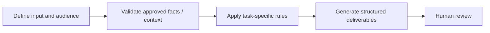

# LinkedIn Ad Creative Assistant

**Portfolio category:** Marketing · Paid social  
**Source catalog entry:** Linkedin Ad Assistant  
**Status:** Documented AI assistant design from an internal tool directory. No enterprise GPT configuration, reference documents, credential access or runnable implementation is included.

## Purpose
Intro text, headline, description and alt text aligned to the landing-page conversion goal.

## Workflow concept

## Inputs
Landing-page URL or content, campaign context.

## Documented output
Intro text, headline, description and alt text aligned to the landing-page conversion goal.

## What the design emphasizes
Derive the offer from the landing page; align messaging and field limits.

## Implementation and evidence boundaries
This case study summarizes a catalog description, rather than reproducing proprietary system instructions or knowledge files. It does not independently demonstrate that the original assistant ran successfully, was integrated into marketing systems, or improved campaign performance. Actual prompts, files and outcomes have not been supplied for public reproduction.

[← Marketing index](README.md) · [← Portfolio home](../README.md)
