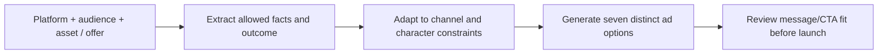

# Paid Media Message Testing Assistant

**Function:** Paid demand generation and creative operations  
**Source basis:** Ad Copy Generator tool card  
**Documented design:** Campaign-brief-driven ad variations; not automated ad buying

## Problem being addressed

Launching a paid campaign often involves repeated rework between demand generation, content and ad operations: translating the offer into concise headlines, checking platform character limits and ensuring the CTA matches the desired conversion. The assistant is designed to standardize that process across channels.

## Input-to-output flow

- **Inputs:** Chosen channel (e.g., LinkedIn, display or account-targeted media), target audience, campaign asset/URL, objective and source-approved context.
- **Processing:** Identify the practical audience benefit, adjust language to platform requirements and avoid unsupported numerical results or hype.
- **Output:** **Seven** structured variants, each with headline, text and CTA, with length rules designed for the platform.

## Marketing value

The intent is to **reduce creative-operations friction and make structured messaging variation repeatable** so paid marketers can spend more time evaluating angles and audience fit rather than rewriting the same offer across placements.

**What this does not do:** It does not run experiments, choose budgets, manage bids, sync with an ad network or optimize performance from live conversion data. The seven outputs are candidates for testing, not evidence of lift.

**Suggested evaluation:** Creative turnaround time, compliance/length pass rate, number of genuinely distinct angles approved and downstream CTR/CVR measured in the ad platforms.

[← Marketing portfolio](README.md)
