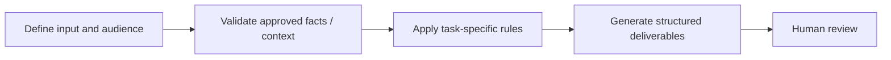

# Paid Acquisition Copy

**Portfolio category:** Marketing · Paid media  
**Source catalog entry:** Digital ad copy generator  
**Status:** Documented AI assistant design from an internal tool directory. No enterprise GPT configuration, reference documents, credential access or runnable implementation is included.

## Purpose
Seven outcome-focused ad variants with CTAs and character discipline.

## Workflow concept

## Inputs
Channel, audience, product context and approved messaging.

## Documented output
Seven outcome-focused ad variants with CTAs and character discipline.

## What the design emphasizes
Constrained copy variation for testing; review product and benefit claims.

## Implementation and evidence boundaries
This case study summarizes a catalog description, rather than reproducing proprietary system instructions or knowledge files. It does not independently demonstrate that the original assistant ran successfully, was integrated into marketing systems, or improved campaign performance. Actual prompts, files and outcomes have not been supplied for public reproduction.

[← Marketing index](README.md) · [← Portfolio home](../README.md)
