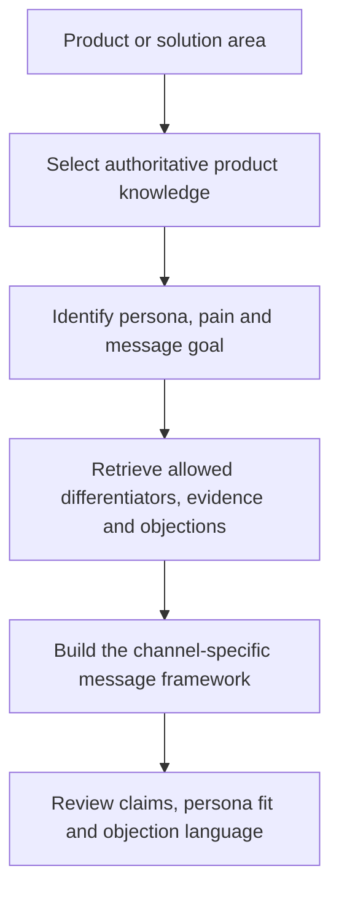

# Knowledge-Grounded Product Marketing Assistants

**Function:** Product marketing, sales enablement and cross-channel messaging consistency  
**Source basis:** Five product-specific assistants from the Tool Library  
**Documented design:** A repeatable approach across distinct product lines, each grounded in its own approved knowledge

## The operating problem

For a multi-product business, campaign teams and sellers need role-specific messaging without misstating product capabilities, confusing solution areas or lifting competitive claims out of context. One generic prompt does not provide reliable controls across varied offerings.

## Reusable architecture

### Knowledge isolation and approved evidence

The source catalog documents **five** assistants for separate product families. Across these designs, the knowledge sources include product datasheets, market-facing assets, buyer-persona definitions, approved objection scripts, competitive positioning materials and case studies. Several tool cards explicitly prioritize a canonical datasheet or other knowledge file when statements conflict.

The differentiation is not the fact that each tool can generate an email. It is that **the same GTM team can produce persona-relevant assets while constraining facts to the correct product's source of truth**.

### Business capabilities

- **Product marketing:** Adapt core value pillars to different stakeholders, compare objections and identify defensible positioning angles.
- **Demand generation:** Translate approved positioning into multi-channel campaigns, nurture sequences, landing-page briefs and webinar concepts.
- **Sales enablement:** Provide talking points and objection responses connected to approved knowledge rather than improvised claims.
- **Governance:** Avoid invented features, numerical outcomes and unsupported competitor weaknesses; flag gaps when source material is insufficient.

### Value and boundaries

This is a **knowledge-management and messaging consistency pattern across product lines**. It reduces the need for every marketer to reconstruct source context for each project, while offering a more controlled starting point for campaign work.

The portfolio intentionally does not distribute the original five knowledge bases, assistant configurations or competitive material. It also does not establish usage, adoption or time savings without separate evidence.

**Suggested evaluation:** Accuracy reviews, consistency across channels, revision cycles, field adoption and time to launch new product campaigns.

[← Marketing portfolio](README.md)
