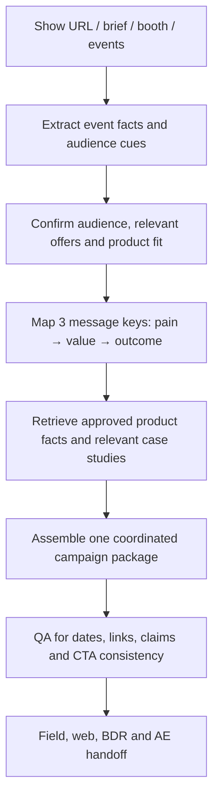

# Trade Show GTM Campaign Orchestration

**Function:** Field marketing, demand generation and sales alignment  
**Source basis:** Trade Show Collateral Generator tool card  
**Artifact type:** Documented multi-asset campaign assistant

## The operational challenge

A conference requires more than an announcement email. Field marketing, demand generation, BDRs, AEs and the web team need aligned messaging, dates, product proof, meeting-booking paths and follow-up. Producing assets independently slows launch and creates inconsistent handoffs.

## Designed workflow

### Cross-functional output package

| Team / motion | Documented deliverables |
|---|---|
| **Field + demand generation** | Event overview, three pre-event promotional emails and three post-event emails |
| **Web team** | Meeting-booking landing page with hero, booth reason-to-visit, proof feature, form CTA and event details |
| **BDR team** | Three-step prospecting sequence with relevance hook, event insight and low-friction follow-up |
| **Account executives** | One-to-one pre-event meeting request and post-event conversation templates |
| **Campaign operations** | Pre-event and post-event outreach-request emails, optional social snippets and QA checklist |

The assistant can extract dates, place and themes from a **show URL**, reconcile add-on events, and assemble assets in one Word-pasteable campaign document. It uses existing example campaigns to govern structure and cadence, and approved product/customer-source materials for claims.

### Value beyond generating text

The objective is **launch coordination at scale**: one agreed audience and message architecture feeds the landing page, marketing emails, sales outreach and follow-up motions. The output makes the dependencies between teams visible earlier, while maintaining a consistent reason to book a meeting.

This is campaign *assembly* and handoff, not proven live orchestration. It does not itself register attendees, segment CRM lists, send emails, book meetings or attribute pipeline.

**Useful measurements:** Time to campaign launch, number of asset revisions, pre-event booked meetings, booth meetings held, post-event follow-up completion and sourced/influenced pipeline. These are measurement recommendations, not outcomes established by the tool card.

[← Marketing portfolio](README.md)
