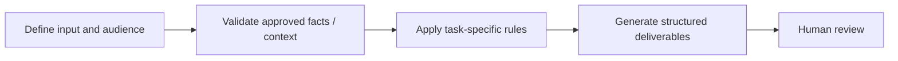

# Trade Show Campaign Kit

**Portfolio category:** Marketing · Field & event marketing  
**Source catalog entry:** Trade Show Collateral Generator  
**Status:** Documented AI assistant design from an internal tool directory. No enterprise GPT configuration, reference documents, credential access or runnable implementation is included.

## Purpose
Pre/post-event emails, landing page copy, BDR/AE outreach and request emails in one package.

## Workflow concept

## Inputs
Conference brief, audience, event specifics and sample tone.

## Documented output
Pre/post-event emails, landing page copy, BDR/AE outreach and request emails in one package.

## What the design emphasizes
Cross-channel message consistency and reusable output structure; no live sends.

## Implementation and evidence boundaries
This case study summarizes a catalog description, rather than reproducing proprietary system instructions or knowledge files. It does not independently demonstrate that the original assistant ran successfully, was integrated into marketing systems, or improved campaign performance. Actual prompts, files and outcomes have not been supplied for public reproduction.

[← Marketing index](README.md) · [← Portfolio home](../README.md)
