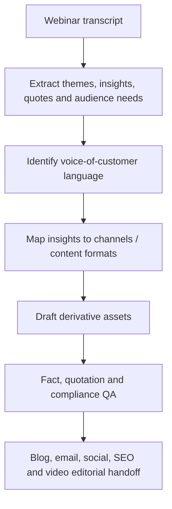

# Webinar-to-Campaign Content System

**Function:** Content strategy, lifecycle demand generation and asset reuse  

## The operational challenge

A live webinar often receives substantial production investment, but the ideas, customer language and supporting insights disappear after the broadcast. This assistant is designed to **turn one long-form source asset into a coordinated content library** while preserving what was actually said.

## Workflow

### Reusable content package

- **Editorial:** Two blog post outlines, actionable tips guide and SEO-focused FAQ section
- **Lifecycle / demand generation:** Two marketing emails
- **Social:** Five LinkedIn posts, LinkedIn carousel script and employee advocacy posts
- **Proof and narrative:** Highlighted quotes and voice-of-the-customer analysis
- **Video team:** suggested source-recording moments for the video team

### Operating value

Instead of asking separate teams to watch a full session and rediscover its strongest points, the assistant structures the webinar's source material into a reusable inventory of themes, customer language and format-specific briefs. It creates a more consistent path from a one-time event to ongoing search, nurture and social distribution.

All substantive output is intended to remain grounded in the transcript; the described rules prohibit fabricated facts, exaggerated claims, PHI and medical advice.

**Performance measures:** Asset utilization per webinar, turnaround time, editorial correction rate, content engagement and downstream campaign contribution. No results are asserted without supporting usage records.

[← Marketing portfolio](README.md)
