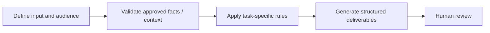

# Webinar Content Repurposing

**Portfolio category:** Marketing · Content operations  
**Source catalog entry:** Repurpose Webinar Content  
**Status:** Documented AI assistant design from an internal tool directory. No enterprise GPT configuration, reference documents, credential access or runnable implementation is included.

## Purpose
Blog outlines, emails, social posts, quotes, FAQs, carousel and clip ideas.

## Workflow concept

## Inputs
Webinar transcript and formatting or compliance constraints.

## Documented output
Blog outlines, emails, social posts, quotes, FAQs, carousel and clip ideas.

## What the design emphasizes
Repurposing source material into multiple formats; clips are proposed, not produced media files.

## Implementation and evidence boundaries
This case study summarizes a catalog description, rather than reproducing proprietary system instructions or knowledge files. It does not independently demonstrate that the original assistant ran successfully, was integrated into marketing systems, or improved campaign performance. Actual prompts, files and outcomes have not been supplied for public reproduction.

[← Marketing index](README.md) · [← Portfolio home](../README.md)
