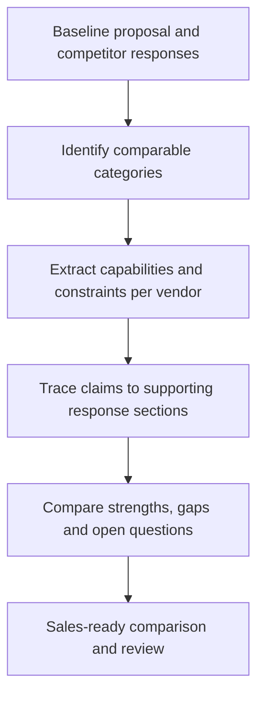

# Evidence-Based Vendor Comparison

**Function:** Competitive intelligence, sales strategy and RFP analysis.

## The challenge

When multiple vendors respond to the same request, sales teams need to understand the **meaningful differences behind the language**, while keeping every comparison tied to a source.

## Workflow

## Core capabilities

- **Structured comparison:** Evaluate each response on shared dimensions instead of comparing documents line by line.
- **Source traceability:** Preserve the supporting passage for each major comparison.
- **Commercial relevance:** Distill the strongest differentiators, potential objections and clarification questions.
- **Confidence-aware analysis:** Distinguish directly supported differences from information requiring further validation.

**Value to the team:** Faster, more disciplined competitive preparation for proposal reviews and account conversations.

[← Sales systems](README.md)
