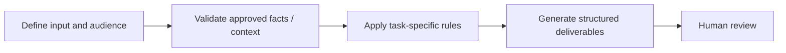

# Competitive Objection Practice

**Portfolio category:** Sales · Enablement  
**Source catalog entry:** Competitive role-play assistant  
**Status:** Documented AI assistant design from an internal tool directory. No enterprise GPT configuration, reference documents, credential access or runnable implementation is included.

## Purpose
Simulated employee-facing conversations for objection practice.

## Workflow concept

## Inputs
Competitive scenario and internal objection context.

## Documented output
Simulated employee-facing conversations for objection practice.

## What the design emphasizes
Scenario simulation only; not live buyer sentiment or verified competitive assessment.

## Implementation and evidence boundaries
This case study summarizes a catalog description, rather than reproducing proprietary system instructions or knowledge files. It does not independently demonstrate that the original assistant ran successfully, was integrated into marketing systems, or improved campaign performance. Actual prompts, files and outcomes have not been supplied for public reproduction.

[← Sales index](README.md) · [← Portfolio home](../README.md)
