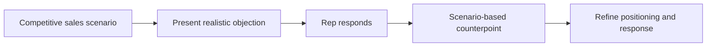

# Competitive Objection Practice

**Function:** Seller coaching and competitive enablement.

## The challenge

Reps often learn the best responses to objections through experience, after a difficult sales conversation. Scenario-based practice offers a more repeatable way to prepare before the meeting.

## Workflow

## Core capabilities

- **Repeatable role-play:** Practice likely competitive pushback in a consistent environment.
- **Messaging reinforcement:** Build familiarity with positioning and approved value arguments.
- **Conversation readiness:** Help reps turn an objection into a productive discovery question.
- **Training flexibility:** Revisit objections across different seller experience levels and account contexts.

**Value to the team:** More consistent objection practice and better access to competitive positioning between formal enablement sessions.

[← Sales systems](README.md)
