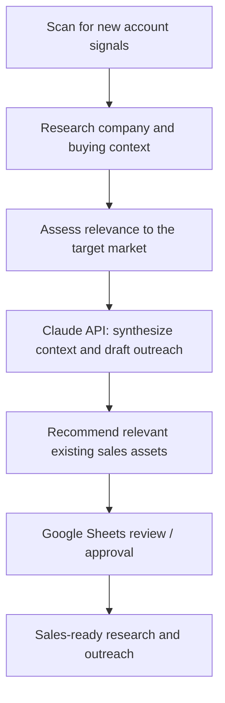

# AI Prospecting Intelligence Platform

**Production AI workflow · Claude Code / Claude API · Railway · Google Sheets**

A signal-driven prospecting system that brings together account discovery, live company research, AI-assisted sales preparation and human approval. The goal is to turn a changing market signal into a relevant opportunity for a sales rep to review and act on.

## What the system does

## Core capabilities

| Component | Role in the workflow |
|---|---|
| **Signal intelligence** | Identify timely account developments and research what changed |
| **Account context** | Connect the account, industry, and observed signal to a potential sales conversation |
| **AI synthesis** | Turn research into a compact, usable narrative and personalized outreach draft via the Claude API |
| **Sales content relevance** | Recommend related existing marketing or customer-story assets, including Seismic-hosted materials |
| **Human approval** | Route recommendations and drafts through a Google Sheets review workflow before reps use them |
| **Application delivery** | Built with Claude Code and deployed to Railway |

## Why this is valuable

The system connects research, relevance assessment, writing and asset selection into a repeatable prospecting workflow. It reduces the burden of manually researching each prospective account while keeping the rep involved in the approval and execution step.

### Engineering themes

- **Current signals + account history:** Ground outreach in why this account may be relevant now.
- **Structured, reusable outputs:** Make findings and drafts easy to review instead of producing unstructured research dumps.
- **API-based AI execution:** Use the Claude API inside an application rather than relying on a manual chat session.
- **Human-in-the-loop design:** Keep an explicit approval stage between generated recommendations and external use.
- **Deployment:** Operate the application through Railway.

This overview focuses on the system architecture and workflow rather than sharing company data, proprietary prompts, or a live production environment.

[← Portfolio homepage](../README.md) · [Acquisition systems →](../acquisition/README.md)
